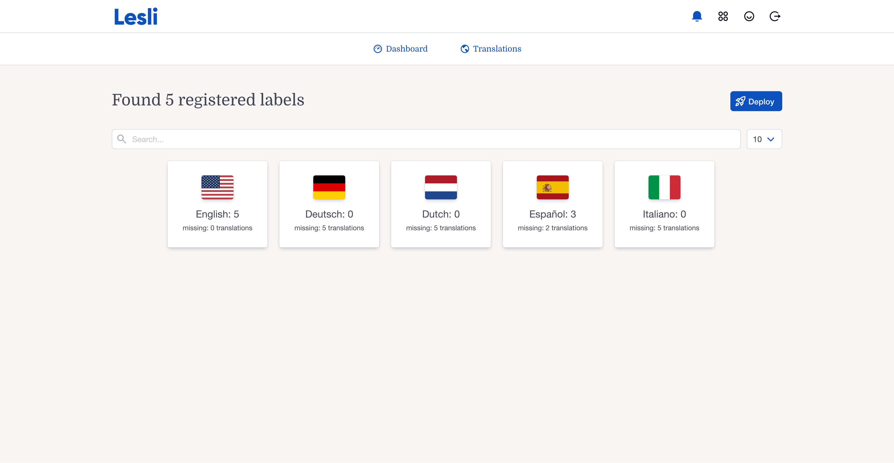

<div align="center">
    <h1 align="center">
        
    </h1>
    <h3 align="center">Translation management for the Lesli Framework.</h3>
</div>

<br />

<div align="center">
    <a target="_blank" href="https://github.com/LesliTech/LesliBabel/actions/workflows/lesli-ci.yaml">
        
    </a>
    <a target="_blank" href="https://rubygems.org/gems/lesli_babel">
        
    </a>
    <a target="_blank" href="https://codecov.io/github/LesliTech/LesliBabel">
        
    </a>
    <a target="_blank" href="https://sonarcloud.io/project/overview?id=LesliTech_LesliBabel">
        
    </a>
</div>

<br />

<div align="center">
    
</div>

---

<br />

## Introduction

LesliBabel is the official translation management engine for the [Lesli Framework](https://github.com/LesliTech/Lesli).

It organizes application text and helps teams maintain, synchronize, and deploy translations across Lesli engines.

<br />

## Features

- Translation modules and buckets
- Centralized label management
- Language-specific translation values
- Synchronization of source labels
- Translation deployment across Lesli applications

<br />

## Try LesliBabel

- [Try the online demo](https://demo.lesli.dev/)
- [Run the Docker demo](https://github.com/LesliTech/lesli-docker-demo)

<br />

## Quick Start

### Requirements

- A Rails application with [Lesli](https://rubygems.org/gems/lesli)
- SQLite by default, or PostgreSQL when preferred by the host application

### Install LesliBabel

Add the engine to the host Rails application and prepare its database:

```shell
bundle add lesli_babel
bin/rails db:prepare
```

### Mount the engine

Applications using Lesli's standard router mount LesliBabel automatically at `/babel`:

```ruby
# config/routes.rb
Rails.application.routes.draw do
    Lesli::Router.mount(self)
end
```

If the application does not use the standard Lesli router, mount the engine directly:

```ruby
# config/routes.rb
Rails.application.routes.draw do
    mount LesliBabel::Engine => "/babel"
end
```

Start Rails and visit [http://127.0.0.1:3000/babel](http://127.0.0.1:3000/babel):

```shell
bin/rails server
```

<br />

## Development

Clone LesliBabel into the host application's `engines` directory:

```shell
cd RailsApp
mkdir -p engines
git clone https://github.com/LesliTech/LesliBabel.git engines/LesliBabel
```

Reference the local engine from the host application's `Gemfile`:

```ruby
gem "lesli_babel", path: "engines/LesliBabel"
```

Install dependencies, prepare the host database, and start Rails:

```shell
bundle install
bin/rails db:prepare
bin/rails server
```

### Tests

From a complete Lesli development workspace, run the engine test suite from the LesliBabel directory:

```shell
cd engines/LesliBabel
bin/rails test
```

<br />

## Documentation

- [Lesli website](https://www.lesli.dev/)
- [Documentation](https://www.lesli.dev/engines/babel)
- [Release notes](https://github.com/LesliTech/LesliBabel/releases)
- [Issue tracker](https://github.com/LesliTech/LesliBabel/issues)
- [Source code](https://github.com/LesliTech/LesliBabel)

<br />

## Community

- [X: @LesliTech](https://x.com/LesliTech)
- [hello@lesli.tech](mailto:hello@lesli.tech)
- [https://www.lesli.tech](https://www.lesli.tech)

<br />

## License

Copyright (c) 2026, Lesli Technologies, S. A.

This program is free software: you can redistribute it and/or modify
it under the terms of the GNU General Public License as published by
the Free Software Foundation, either version 3 of the License, or
(at your option) any later version.

This program is distributed in the hope that it will be useful,
but WITHOUT ANY WARRANTY; without even the implied warranty of
MERCHANTABILITY or FITNESS FOR A PARTICULAR PURPOSE. See the
GNU General Public License for more details.

You should have received a copy of the GNU General Public License
along with this program. If not, see [https://www.gnu.org/licenses/](https://www.gnu.org/licenses/).

The complete license text is available in the [license file](./license).

---

<br />
<br />

<div align="center">
    
    <h3 align="center">The Open-Source SaaS Development Framework for Ruby on Rails.</h3>
</div>
